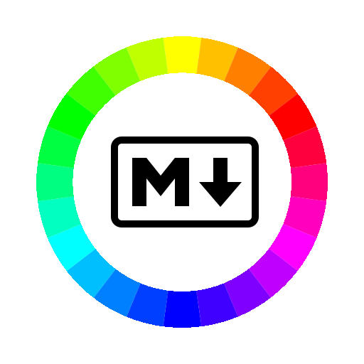

<h1 align="center">

<br>
</h1>

<h4 align="center">Blazor markdown editor with drawing support</h4>

## WIP

**This project is a work in progress.**
## Setup

Make sure you have [Node.js](https://nodejs.org/), [Yarn](https://yarnpkg.com/) and [.NET Core SDK](https://dotnet.microsoft.com/download/dotnet-core) installed.

```bash
$ git clone https://github.com/jonathanjameswatson/markdraw.git # or clone your own fork
$ cd markdraw
$ yarn install
```

## Usage

```bash
# To run in development at localhost:3000
$ yarn run dev

# To build the project at release/wwwroot
$ yarn run build
```